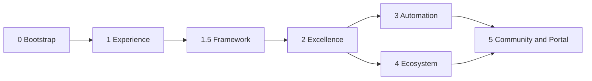

# Roadmap

> Long-term product strategy for RSProjects Showcase.  
> **Governance:** [`docs/GOVERNANCE.md`](docs/GOVERNANCE.md)  
> Operational status: [`PROJECT_STATUS.md`](PROJECT_STATUS.md).  
> Phase briefs: [`docs/PHASE_2_SHOWCASE_EXCELLENCE.md`](docs/PHASE_2_SHOWCASE_EXCELLENCE.md) · [`docs/roadmap/`](docs/roadmap/).

Priorities may reorder as the product evolves; phase **purpose** stays stable.

---

## Guiding principles

1. **Every phase should increase value for users while reducing maintenance for the maintainer.**
2. **Prefer reusable platform capabilities over project-specific features.**
3. **Keep all architecture metadata-driven.**
4. **Avoid hardcoded project behavior** (UI never branches on `project.id`).
5. **Preserve** content → registry → domain → application → presentation.
6. **Treat planning documents as architectural guidance, not implementation specifications.**

### Hard rules (all phases)

- One generic showcase template for every RSProjects product.
- Sections render only when content exists.
- DTOs never reach the UI; mapping layer mandatory.
- Web-first; all Flutter platforms must stay healthy.
- Authored content and generated artifacts stay clearly separated.

---

## Phase 0 — Architecture bootstrap

**Status:** Complete  
**Purpose:** Establish a safe, scalable repo shape before product UI.

**Vision:** A feature-first Flutter foundation that can grow without rewrites.

**Major milestones:** Folder structure · docs/scripts/workflow stubs · GitHub connected.

**Exit criteria:** Repository usable for incremental delivery; platforms and docs placeholders in place.

**Dependencies:** None.

---

## Phase 1 — Experience Foundation

**Status:** Complete  
**Purpose:** Ship a real portal shell with content-driven catalog and home.

**Vision:** Visitors can browse RSProjects products from a generated registry.

**Major milestones:** App shell · design system · quality foundation · content pipeline · Riverpod catalog/detail · Home.

### Phase 1.5 — Showcase Content Framework

**Status:** Complete  
**Purpose:** One canonical project page for every product.

**Vision:** Adding a project is content + template, not a custom screen.

**Major milestones:** `showcase` schema · `ProjectShowcaseTemplate` · Document Platform reference fill.

**Exit criteria:** Generic template live; conditional sections; registry asset loading.

**Dependencies:** Phase 1 catalog/detail stack.

---

## Phase 2 — Showcase Excellence

**Status:** 2.0 Complete · **2.1 Complete** · 2.2–2.5 Planned  
**Purpose:** Elevate the portal into a compelling developer showcase—still fully generic.  
**Brief:** [`docs/PHASE_2_SHOWCASE_EXCELLENCE.md`](docs/PHASE_2_SHOWCASE_EXCELLENCE.md)

**Vision:** Rich pages, demos, docs, search, and ecosystem rails without product-specific UI.

**Major milestones:**

| Milestone | Focus | Status |
|-----------|--------|--------|
| 2.0 | Planning lock | Complete |
| 2.1 | Rich project pages (media, contributors, downloads) | **Complete** |
| 2.2 | Interactive demos (`DemoSpec`) | Planned |
| 2.3 | Documentation hub | Planned |
| 2.4 | Search & discovery (+ collections) | Planned |
| 2.5 | Ecosystem navigation (typed relations foundation) | Planned |

**Exit criteria:** Showcase template carries rich media/demos/docs entry points; `/search` and relations primitives exist; no `project.id` branching.

**Dependencies:** Phase 1.5 template + content model.

**Suggested build order:** ~~schema/index → rich media~~ → DemoSpec → docs hub → search/collections → ecosystem UI.

---

## Phase 3 — Automation & Publishing

**Status:** Planned  
**Purpose:** Make the showcase largely self-maintaining.  
**Brief:** [`docs/roadmap/PHASE_3_AUTOMATION.md`](docs/roadmap/PHASE_3_AUTOMATION.md)

**Vision:** Authors maintain intentional content; CI generates indexes, validates drift, builds demos, and publishes releases.

**Major milestones:**

| Milestone | Focus |
|-----------|--------|
| 3.1 | Authored vs generated boundary lock |
| 3.2 | Generation toolchain (registry, docs/media indexes, enrichment) |
| 3.3 | CI quality gates as product automation |
| 3.4 | Artifact & demo pipelines (lifecycle) |
| 3.5 | Publishing & GitHub Release integration |

**Exit criteria:** Documented publish workflow · artifact lifecycle · generated-asset ownership · named Actions responsibilities · version sync policy—ready to implement without redesigning the content model.

**Dependencies:** Phase 2 content shapes (docs/media/collections); hosting decision (D-011) for production deploy.

**Also absorbs:** production deploy, quality-gate CI, and release-oriented polish formerly sketched as “polish and scale.”

---

## Phase 4 — Ecosystem Intelligence

**Status:** Planned  
**Purpose:** Help visitors see how RSProjects products relate.  
**Brief:** [`docs/roadmap/PHASE_4_ECOSYSTEM.md`](docs/roadmap/PHASE_4_ECOSYSTEM.md)

**Vision:** Data-driven explorers for relations, technologies, packages, timelines, and collections—platform capabilities, not one-off graphs.

**Major milestones:**

| Milestone | Focus |
|-----------|--------|
| 4.1 | Domain model lock (`ProjectRelation`, `Technology`, `Collection`, `TimelineEvent`, `PackageReference`) |
| 4.2 | Registry/index enrichment |
| 4.3 | Technology / package / graph explorer surfaces |
| 4.4 | Cross-project timeline |
| 4.5 | Authored vs inferred edge quality |

**Exit criteria:** Documented domain models and explorer contracts; clear authored vs inferred policy; builds on Phase 2.4/2.5 without duplicating them.

**Dependencies:** Phase 2 relations/collections foundations; Phase 3 generation preferred at scale.

---

## Phase 5 — Community & Developer Portal

**Status:** Planned  
**Purpose:** Evolve the showcase into a public engineering portal.  
**Brief:** [`docs/roadmap/PHASE_5_DEVELOPER_PORTAL.md`](docs/roadmap/PHASE_5_DEVELOPER_PORTAL.md)

**Vision:** Community participation and developer tooling share one shell and one content architecture—feedback, contributors, releases, docs, playgrounds, downloads, templates, and a design-system explorer.

**Major milestones:**

| Milestone | Focus |
|-----------|--------|
| 5.1 | Portal information architecture (Community + Develop) |
| 5.2 | Community surfaces (feedback, profiles, roadmap, releases, beta, gallery) |
| 5.3 | Developer surfaces (docs, API refs, playgrounds, downloads, templates, DS explorer, notes) |
| 5.4 | Trust & moderation boundaries |
| 5.5 | Continuity with Phases 2–4 primitives |

**Exit criteria:** Portal IA and reusable abstractions documented; community and developer capabilities planned as one phase (no split that would duplicate planning); reuse of DemoSpec, docs indexes, downloads, releases, and explorers explicit.

**Dependencies:** Phase 2 docs/demos/downloads; Phase 3 publishing/releases; Phase 4 aggregation optional but complementary.

---

## Phase map (at a glance)

---

## Flexibility

- Milestones inside a phase may reorder when user value or maintainer cost changes.
- Phase 3 and 4 may overlap once Phase 2 primitives exist.
- Open product decisions (hosting D-011, license D-012) can gate deploy automation without blocking earlier UX work.
- **Execution-first:** do not expand this roadmap or add large planning docs by default—see [`docs/GOVERNANCE.md`](docs/GOVERNANCE.md) §2a.
- **D-027:** examples are first-class content (alongside projects). That direction informs later search, automation, and playgrounds; it does not add a new phase.
