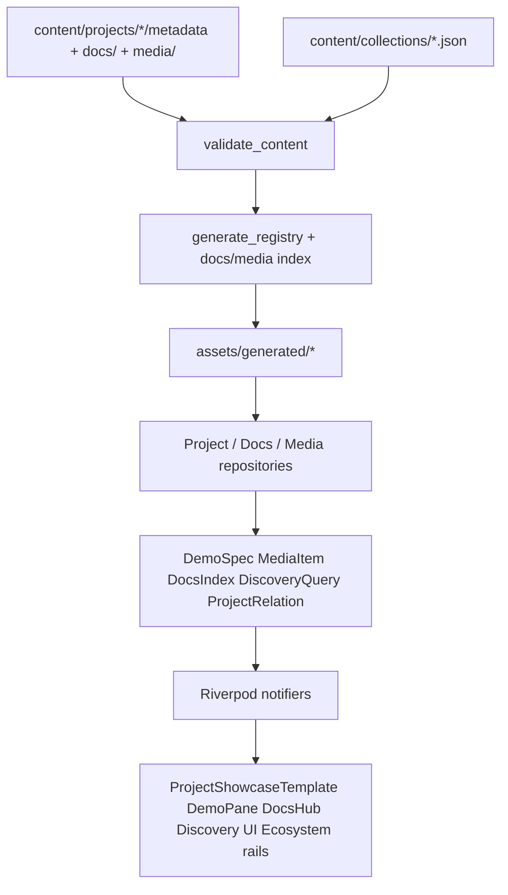

# Phase 2 — Showcase Excellence

Architecture and planning brief. **No features are implemented by this document alone.**

| Meta | Value |
|------|--------|
| Status | Planning lock (2.0) |
| Depends on | Phase 1 Experience Foundation + Phase 1.5 Showcase Content Framework |
| Roadmap | [`ROADMAP.md`](../ROADMAP.md) |
| Schema (current) | [`CONTENT_MODEL.md`](CONTENT_MODEL.md) |
| Template | [`SHOWCASE_FRAMEWORK.md`](SHOWCASE_FRAMEWORK.md) |
| Operational SSOT | [`PROJECT_STATUS.md`](../PROJECT_STATUS.md) |
| Later phases | [`docs/roadmap/`](roadmap/) (Phases 3–5) |

---

## Objective

Elevate RSProjects Showcase from a polished catalog into a compelling developer showcase platform—while keeping every capability **generic and reusable** across current and future products.

## Principles

1. **One template** — continue `ProjectShowcaseTemplate`; add section renderers, never product forks.
2. **Content-driven** — metadata + local docs/media → validate → generate → registry/index → domain → UI.
3. **Conditional sections** — omit empty content; placeholders only where the framework requires them (e.g. demo unavailable).
4. **Automation-ready** — stable field shapes so future tooling can populate sections from docs and codegen.
5. **No `project.id` branching** in presentation.

## Baseline to reuse

```
content/projects/*/metadata.json
  → scripts/validate_content.dart
  → scripts/generate_registry.dart
  → assets/generated/registry.json
  → AssetRegistryProjectRepository
  → Project / ProjectShowcase
  → ProjectsCatalogNotifier / projectByIdProvider
  → ProjectShowcaseTemplate
```

Catalog-local search already exists; dedicated `/search` is Phase 2.4. Demo today is placeholder / URL-only (`showcase.demo`).

## Architecture (target)



---

## Milestone 2.1 — Rich Project Pages

**Status:** Complete

Elevate the existing page; still **one** generic detail experience.

| Capability | Content | UI approach |
|------------|-----------------|-------------|
| Hero media | `showcase.heroMedia` | Banner media above hero copy (placeholder when `src` missing) |
| Feature highlights | `features[]` + optional `icon` / `media` | Existing feature grid, richer cells |
| Architecture | `architecture` + optional `architectureDiagram` | Text + diagram media |
| Gallery | Unified `showcase.media[]` (`kind`: image \| video \| diagram) | Gallery section (prefers `media`; falls back to `screenshots`) |
| Videos | `media` entries with `kind: video` | Same gallery pattern |
| Benchmarks | Existing `benchmarks[]` | Keep; layout polish |
| Release history | Existing `changelog[]` | Keep; section subtitle |
| Related | `relatedProjectIds` (+ typed relations in 2.5) | Related rail |
| Contributors | `contributors[]` | Conditionally rendered list |
| Downloads | `downloads[]` | Conditionally rendered link list |

---

## Milestone 2.2 — Interactive Demos

### DemoSpec (domain)

Sealed model driven by metadata—**never** hardcode a product iframe.

| Variant | Metadata | UI |
|---------|----------|-----|
| `embeddedWeb` | `demo.kind: embedded_web` + `embedUrl` | Web: sandboxed iframe / platform view; other platforms: deep-link CTA |
| `externalLink` | `demo.kind: external` + `url` | Primary “Open demo” action |
| `mediaFallback` | `demo.kind: media` + media refs | Screenshot/video gallery as stand-in |
| `unavailable` | missing / `available: false` | Existing placeholder pattern |

Non-web products default to `mediaFallback` or `externalLink`.

### Presentation

- Generic `DemoPane` widget maps any `DemoSpec` → UI.
- Lives beside (or replaces) the current demo section inside `ProjectShowcaseTemplate`.

---

## Milestone 2.3 — Documentation Hub

### Source of truth (local-first)

```
content/projects/<id>/
  metadata.json
  docs/          # README.md, guides/, tutorials/, examples/, CHANGELOG.md, ROADMAP.md, api/
  media/         # screenshots, videos, diagrams
```

- Registry stores a **docs index** (title, path, type)—not full markdown bodies.
- Route: `/projects/:id/docs` (+ optional `/*path`).
- Shared markdown viewer under `lib/shared/markdown/` (package added only at implementation time).
- External `documentationLinks` remain for remote / API docs.

---

## Milestone 2.4 — Search & Discovery

- Dedicated `/search` (wire `features/search`).
- Shared `DiscoveryQuery`: text, status, category, platform, tags, tech, collection.
- Reuse query helpers from projects domain; catalog filters and search stay consistent.
- Collections: `content/collections/*.json` → generated collections slice in registry.
- Home featured / collection rails stay registry-driven.

---

## Milestone 2.5 — Ecosystem Navigation

### Relations

```json
"relations": [
  { "targetId": "localization_analyzer", "type": "related" }
]
```

Allowed `type`: `related` | `depends_on` | `depended_on_by` | `shares_tech` | `alternative`.

- Soft edges: derive from shared `technologies` / `tags` when explicit relations are absent.
- Shared widgets: `RelatedProjectsRail`, `TechChipLink`, later `EcosystemGraph`—all registry-fed.

---

## Reusable abstractions (implementation map)

| Abstraction | Layer | Role |
|-------------|-------|------|
| `DemoSpec` | domain | Sealed demo variants |
| `MediaItem` | domain | Image / video / diagram |
| `DocsDocument` / `DocsIndex` | domain | Hub navigation |
| `DiscoveryQuery` | domain | Shared search/filter |
| `ProjectRelation` | domain | Ecosystem edges |
| `ProjectShowcaseTemplate` | presentation | Sole detail shell |
| `DemoPane` | presentation | Renders any `DemoSpec` |
| `DocsHubScreen` | presentation | Generic docs browser |
| `DiscoveryNotifier` | application | Search + collections |
| Asset / docs repositories | infrastructure | Bundle (+ optional remote later) |

---

## Suggested implementation order

1. Schema + validation + registry/docs/media index (no rich UI yet)
2. Rich media sections on existing template
3. `DemoSpec` + `DemoPane`
4. Docs hub + markdown viewer
5. `/search` + collections
6. Ecosystem relations UI

---

## Out of scope for Phase 2

- Hosting selection (D-011)
- Full remote `fetch_projects` automation (may run in parallel backlog)
- SaaS analytics / crash reporters
- Project-specific showcase forks

---

## Decisions (see PROJECT_STATUS)

| ID | Decision |
|----|----------|
| D-023 | `DemoSpec` sealed variants: embedded_web / external / media / unavailable |
| D-024 | Docs hub local-first under `content/projects/<id>/docs/` |
| D-025 | Dedicated `/search` with shared `DiscoveryQuery` |
| D-027 | Examples are first-class content alongside projects (not project-owned assets only) |
