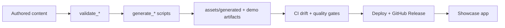

# Phase 3 — Automation & Publishing

Planning brief. **Not an implementation specification.**

| Meta | Value |
|------|--------|
| Status | Planned (after Phase 2) |
| Depends on | Phase 2 Showcase Excellence (especially docs/media indexes, DemoSpec content shapes) |
| Roadmap | [`ROADMAP.md`](../../ROADMAP.md) |
| Related | [`docs/CI_CD.md`](../CI_CD.md), [`docs/DEPLOYMENT.md`](../DEPLOYMENT.md), [`docs/quality/QUALITY_GATES.md`](../quality/QUALITY_GATES.md) |

---

## Vision

Reduce manual work so the showcase is largely **self-maintaining**: authored content stays intentional; everything derivable is generated, validated, and published through reusable automation.

## Goals

Plan reusable automation for:

- Registry generation (already started; deepen + CI-gate)
- Metadata generation / enrichment (from repos, pubspec, releases—never inventing product UI)
- Documentation indexing (builds on Phase 2.3 docs index)
- Screenshot / media generation pipelines
- Demo artifact generation (Web builds, embed packages)
- GitHub Release integration
- Version synchronization across metadata, app, and release tags

Document publishing workflow, artifact lifecycle, generated vs authored ownership, and future GitHub Actions responsibilities—**without implementing them in this phase’s planning doc.**

---

## Major milestones

### 3.1 — Content vs generated boundary lock

- Catalog **authored** paths (`content/projects/*/metadata.json`, `docs/`, intentional media)
- Catalog **generated** paths (`assets/generated/*`, optional build/demo artifacts)
- Document “never hand-edit generated” rules in CI and contributor docs

### 3.2 — Generation toolchain (scripts)

- Harden `validate_content` / `generate_registry`
- Add planned generators: docs index, media manifest, collections index
- Optional enrichment: version sync from release tags / package versions

### 3.3 — CI quality gates as product automation

- Format → analyze → test → validate content → generate → drift check → build
- Fail PRs when generated artifacts are stale or authored content is invalid

### 3.4 — Artifact & demo pipelines

- Screenshot/media generation jobs (or documented manual→asset handoff)
- Demo artifact builds (Flutter Web demos) with stable embed URLs/paths
- Lifecycle: create → validate → publish → expire/archive

### 3.5 — Publishing & releases

- Hosting deploy workflow (depends on D-011)
- GitHub Release integration (notes, assets, version bump hooks)
- Publishing runbook: who triggers what, what is auto vs manual

---

## Reusable abstractions

| Abstraction | Role |
|-------------|------|
| `GenerationPipeline` | Ordered steps: validate → enrich → generate → verify |
| `ArtifactKind` | `registry` \| `docs_index` \| `media_manifest` \| `demo_bundle` \| `web_build` |
| `ArtifactRef` | Stable id, path/URL, version, checksum, producedBy, producedAt |
| `PublishTarget` | Hosting / Releases / GitHub Pages / etc. (config, not code yet) |
| `ContentOwnership` | `authored` vs `generated` markers for paths |
| `ReleaseSync` | Maps GitHub Release / semver → project `version` / changelog hooks |

Preserve: **content → registry → domain → application → presentation**.

---

## Planned architecture

### Authored vs generated

| Kind | Examples | Owner |
|------|----------|--------|
| Authored | `metadata.json`, hand-written docs, curated screenshots | Project / content owners |
| Generated | `registry.json`, docs/media indexes, build outputs, auto screenshots | Tooling / CI |
| Hybrid | Changelog: authored source of truth *or* imported from Releases (policy per project) | Documented per field |

### Future GitHub Actions (identify only)

| Workflow | Responsibility |
|----------|----------------|
| `ci.yml` | Quality gates + content validate + generate drift check |
| `fetch-projects.yml` | Optional remote discovery / sync PRs |
| `generate-artifacts.yml` | Docs index, media, demo bundles on demand or on tag |
| `deploy.yml` | Web publish to chosen host |
| `release.yml` | Tag → Release notes/assets → optional metadata version sync |

---

## Dependencies

- Phase 2 docs/media/collections shapes stable enough to index
- Hosting decision (D-011) before production deploy automation
- Existing scripts under `scripts/` and workflow stubs under `.github/workflows/`

## Out of scope

- Implementing Actions or generators in this planning pass
- SaaS build farms or paid screenshot services (may evaluate later)
- Replacing authored metadata with fully automated invention of product copy
- Duplicating Phase 2 UI milestones

## Exit criteria

- [ ] Authored vs generated boundary documented and enforced in planned CI design
- [ ] Generation + publish workflows named with clear ownership
- [ ] Artifact lifecycle (create → publish → archive) documented
- [ ] Version/release sync policy documented
- [ ] ROADMAP Phase 3 exit criteria satisfied without requiring feature UI
