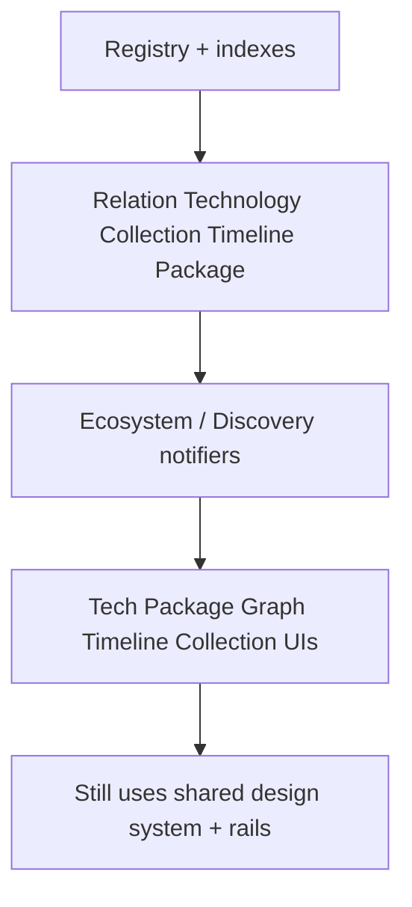

# Phase 4 — Ecosystem Intelligence

Planning brief. **Not an implementation specification.**

| Meta | Value |
|------|--------|
| Status | Planned (after Phase 2 foundation; typically after or alongside early Phase 3 automation) |
| Depends on | Phase 2.4 collections + Phase 2.5 relations (foundation); registry indexes from Phase 3 help at scale |
| Roadmap | [`ROADMAP.md`](../../ROADMAP.md) |
| Does not replace | Phase 2 Showcase Excellence — this phase **deepens** ecosystem capabilities into explorers and intelligence |

---

## Vision

Help visitors **understand how RSProjects products relate**—dependencies, shared technologies, packages, timelines, and curated collections—through reusable, data-driven platform capabilities (never project-specific graphs).

## Goals

Plan reusable capabilities:

- Dependency / relation graph
- Related projects (typed + soft edges)
- Technology explorer
- Package explorer
- Timeline / release history across products
- Shared technology relationships
- Collections (curated sets)

Define reusable domain models (planned):

- `ProjectRelation`
- `Technology`
- `Collection`
- `TimelineEvent`
- `PackageReference`

All remain **generic and metadata-/registry-driven**.

---

## Relationship to Phase 2

Phase 2.5 introduces typed `relations[]` and soft tech/tag edges on the project page.  
Phase 2.4 introduces collections for discovery.

**Phase 4** turns those primitives into **platform explorers**:

| Phase 2 (foundation) | Phase 4 (intelligence) |
|----------------------|-------------------------|
| Related rail on a project page | Global / filterable relation graph |
| Tech badges on a project | Technology explorer (“all projects using X”) |
| Collections on Home/search | Collection detail + cross-links |
| Per-project changelog | Cross-project timeline |

Do not re-plan Phase 2 UI here—extend it.

---

## Major milestones

### 4.1 — Domain model lock

- Formalize `ProjectRelation`, `Technology`, `Collection`, `TimelineEvent`, `PackageReference` in content-model planning
- Mapping rules: authored relations vs inferred soft edges (clear precedence)

### 4.2 — Registry / index enrichment

- Emit relation graph slice, technology index, package index, timeline events from content + optional package manifests
- Prefer generated indexes; keep inference rules pure and testable

### 4.3 — Explorer surfaces (generic)

- Technology explorer route/page pattern
- Package explorer route/page pattern
- Ecosystem graph view (progressive: list → graph)
- Collection detail experience

### 4.4 — Cross-project timeline

- Aggregate `TimelineEvent` from changelogs / releases / milestones
- Filter by project, tech, collection

### 4.5 — Intelligence quality

- Document confidence for inferred edges
- Avoid noisy soft links; allow authored overrides

---

## Reusable abstractions

| Abstraction | Layer (planned) | Role |
|-------------|-----------------|------|
| `ProjectRelation` | domain | `{ targetId, type, source? }` — authored or inferred |
| `Technology` | domain | Canonical tech id + display label + project ids |
| `Collection` | domain | Curated set of project ids + copy |
| `TimelineEvent` | domain | `{ at, projectId?, title, kind, url? }` |
| `PackageReference` | domain | Package name/ecosystem/version/url + project ids |
| `EcosystemGraph` | presentation | Generic graph/list renderer over relations |
| `TechExplorer` / `PackageExplorer` | presentation | Filterable indexes—no per-product pages |
| `EcosystemNotifier` | application | Loads indexes; applies DiscoveryQuery-compatible filters |

**Hard rule:** UI never branches on `project.id`.

---

## Planned architecture

Data sources (planned, layered):

1. Authored: `relations`, `technologies`, `collections`, changelog
2. Generated: normalized indexes
3. Inferred: soft `shares_tech` / tag overlap (marked as inferred)

Preserve: **content → registry → domain → application → presentation**.

---

## Dependencies

- Phase 2.4 / 2.5 primitives available (or stubbed in schema)
- Phase 3 generation helpful for keeping indexes fresh at scale
- Search/`DiscoveryQuery` (Phase 2.4) should accept tech/collection filters reused by explorers

## Out of scope

- Replacing Phase 2 project-page related rails
- Social graphs of people (contributors stay Phase 5)
- Hardcoded “Document Platform graph” or any product-specific explorer
- Implementing graph libraries or new packages in this planning pass

## Exit criteria

- [ ] Domain models documented and aligned with content-model “planned” section
- [ ] Authored vs inferred relation policy clear
- [ ] Explorer capabilities listed with generic UI contracts
- [ ] Timeline and package/tech indexes described without requiring implementation
- [ ] No duplication of Phase 2 Showcase Excellence planning
