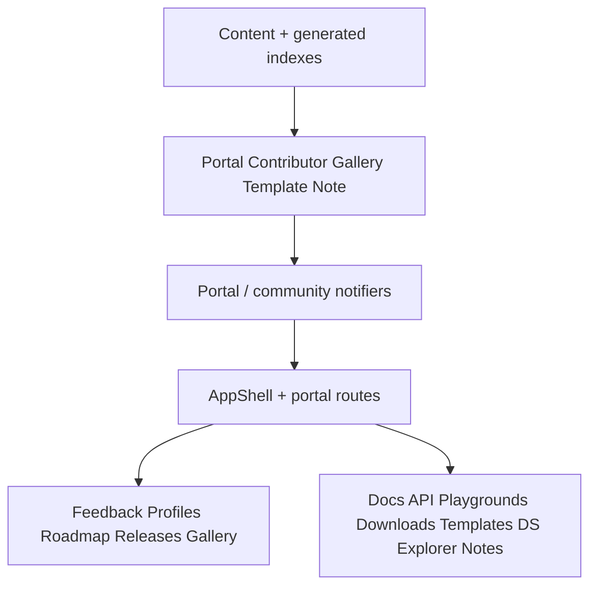

# Phase 5 — Community & Developer Portal

Planning brief. **Not an implementation specification.**

| Meta | Value |
|------|--------|
| Status | Planned (after Phase 2 surfaces; Phase 3 publishing strengthens releases/feedback loops) |
| Depends on | Phase 2 docs hub / downloads / demos; Phase 3 release automation; Phase 4 explorers optional but complementary |
| Roadmap | [`ROADMAP.md`](../../ROADMAP.md) |
| Related | [`docs/quality/COMMUNITY_FEEDBACK.md`](../quality/COMMUNITY_FEEDBACK.md), design system under `lib/design_system/` |

---

## Vision

Transform the showcase from a strong product catalog into a **public engineering portal**: community participation on one side, reusable developer tooling and knowledge on the other—without splitting into two competing sites.

Community and Developer Portal are planned **together** so feedback, releases, docs, playgrounds, and the design system share one architecture and navigation model.

---

## Goals

### Community

Plan reusable capabilities for:

- Feedback (builds on quality feedback abstractions)
- Contributor profiles
- Public roadmap
- Release notes
- Beta testing signals
- Showcase gallery (community or curated submissions)

### Developer Portal

Plan reusable capabilities for:

- Documentation hub (extends Phase 2.3 beyond per-project into portal-wide IA)
- API reference patterns
- Playgrounds
- Downloads
- Templates
- Design System explorer
- Engineering notes

Document how these fit the existing architecture—**without** implementation specs or new dependencies in this planning pass.

---

## Major milestones

### 5.1 — Portal information architecture

- Navigation model: Community vs Develop sections under one shell
- Shared routes that remain content-/registry-driven
- Avoid a second app or hardcoded product microsites

### 5.2 — Community surfaces

- Feedback entry points (issue templates, in-app report hooks already sketched in quality)
- Contributor profile model (generic; data from content or GitHub-derived indexes)
- Public roadmap surface (portal-level + links into project roadmaps)
- Release notes hub (aggregates Phase 3/4 timeline + per-project changelog)
- Beta badges / opt-in lists (content-driven flags, not custom apps)
- Gallery: submissions as content entries validated like projects

### 5.3 — Developer portal surfaces

- Portal docs index (cross-project + platform docs)
- API reference viewer pattern (OpenAPI/dartdoc links or rendered refs—policy later)
- Playgrounds (generic host for DemoSpec / templates)
- Downloads center (extends `downloads[]`)
- Project / app templates catalog
- Design System explorer (live tokens/components from `lib/design_system`)
- Engineering notes (ADR-like content collection)

### 5.4 — Trust & moderation boundaries

- What is authored vs community-submitted vs generated
- Ownership for gallery and feedback triage

### 5.5 — Continuity with earlier phases

- Reuse `DemoSpec`, docs indexes, collections, relations, release artifacts
- No parallel content pipelines

---

## Reusable abstractions

| Abstraction | Role |
|-------------|------|
| `PortalSection` | IA unit: community \| develop \| project |
| `ContributorProfile` | `{ id, name, roles[], urls[], avatar? }` |
| `FeedbackChannel` | Issue / email / form — maps to existing quality ports |
| `ReleaseNotesSet` | Aggregated notes by product or portal |
| `BetaProgram` | Content flag + instructions + links |
| `GalleryItem` | Validated content entry (screenshot/demo/story)—not free-form HTML |
| `TemplateRef` | Starter template metadata (repo, platforms, tags) |
| `DesignSystemCatalog` | Index of tokens/components for explorer |
| `EngineeringNote` | Long-form note with tags and related project ids |
| `PortalNav` | Data-driven nav config (not hardcoded product menus) |

Presentation stays on shared design-system components and generic templates.

---

## Planned architecture

Fit into existing stack:

- **UI → State → Domain → Data** unchanged
- New features get feature folders only when needed (`features/portal`, `features/community`, …) or extend `docs` / `home`
- Feedback reuses `lib/core/quality` contracts
- Design System explorer reads the same tokens the app already uses

Preserve: **content → registry → domain → application → presentation**.

---

## Dependencies

- Phase 2 docs hub, downloads, demos (for portal building blocks)
- Phase 3 publishing/releases (for trustworthy release notes and version sync)
- Phase 4 timeline/collections (nice-to-have for richer hub aggregation)
- Open: hosting (D-011), license (D-012), moderation policy for gallery

## Out of scope

- Building auth/accounts systems in planning (defer identity decisions)
- Implementing playground runtimes or dartdoc hosting here
- Splitting “Community” and “Developer Portal” into separate long-term phases
- Invalidating Phase 2 planning or inventing project-specific portal pages

## Exit criteria

- [ ] Community + Developer Portal capabilities listed as reusable platform features
- [ ] IA and ownership boundaries documented
- [ ] Abstractions models named without requiring code
- [ ] Clear reuse of Phase 2–4 primitives
- [ ] ROADMAP Phase 5 reads as product strategy, not a feature dump
